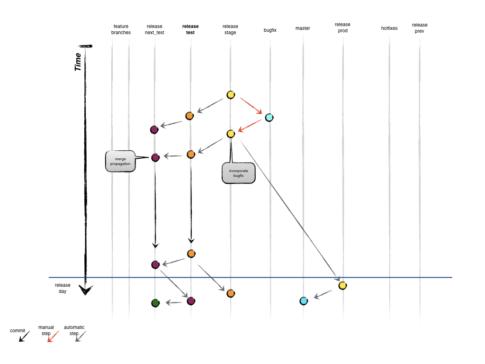
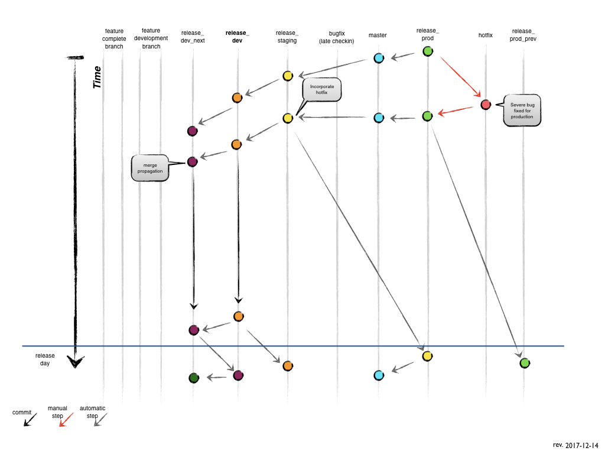

Bugfix (Late Checkin) and Hotfix Branches
=========================================

To demonstrate the workflow, in this documentation we'll refer to each release as:

* `release_prod_prev` = previous week released code
* `release_prod` = released and currently running
* `release_staging` = code currently testing by QA for release the next week
* `release_dev` = feature merging for QA testing next week and production release in 2 weeks
* `release_dev_next` = feature merging or incremental changes dependent on code from `release_dev` or earlier

> **NOTE:**
> Each release branch above corresponds to a release branch with a date formatted `release_YYYYMMDD` that changes automatically each week. (i.e. `release_20171207`)

Bugfix Branch (Late Checkin)
============================

*Branches from:*

* `release_staging`

*Merges into:*

* `release_staging` and propagated to future branches

*Branch naming convention:*

`MTP-1234_release_staging`

- Checkout new branch from `release_staging` branch
- Make changes, commit
- Create Pull Request from `MTSOPS-1234_release_staging` to `release_staging`
- Merge when PR is approved and Codeship status checks are complete
- After bugfix is merged, the `release_staging` branch should be merged back to the `release_dev` and subsequent branches
- Deploys to the staging environment

Hotfix Branch
=============

*Branches from:*

* `release_prod`

*Merges into:*

* `release_prod` and propagated to `master` then future branches

*Branch naming convention:*

* `MTP-1234_release_prod`

### Creating the hotfix branch

- Create a hotfix branch from `release_prod`
- Make code changes, add, commit

### Finishing a hotfix branch

- Create a PR from `MTP-1234_release_prod` to `release_prod`
- Merge hotfix from `release_prod` to `master`
- Merge hotfix from `master` to `release_staging`
