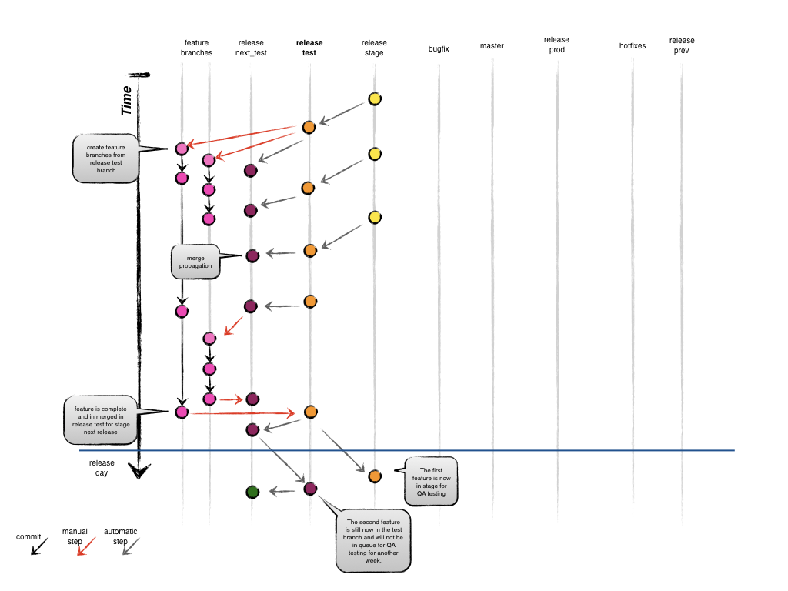

Feature Branches
================

*Branch from:*

* `release_test` or future branches

*Merges into:*

* `release_test` or future branches

*Branch naming convention:*

* anything except `master` or `release_YYYYMMDD`





### Creating a feature branch
When starting work on a new feature, branch off from the `release_test` branch.

```
git fetch upstream
git checkout -b MTP-1234_release_test release_test
```

### Incorporating a finished feature on `release_test`
Finished features may be merged into the `release_test` branch to definitely add them to the upcoming release:

- Make some code changes, commit
```
git add <files>
git commit -m "gitflow commit feature"
```

- Pull `release_test` branch into feature, fix any conflicts (if any), commit
```
git merge upstream/release_test
git push upstream MTP-1234_release_test
```

- Make a pull request against a `release_test` branch
	- complete the form with the ticket number and summary of changes
	- request a reviewer
	- submit

- Codeship is run against the merge pull request and will not allow a merge until build is successful.

### After Feature Completed Merge

- After a commit is merged into `release_test` it will automatically propagate to the future release branches.