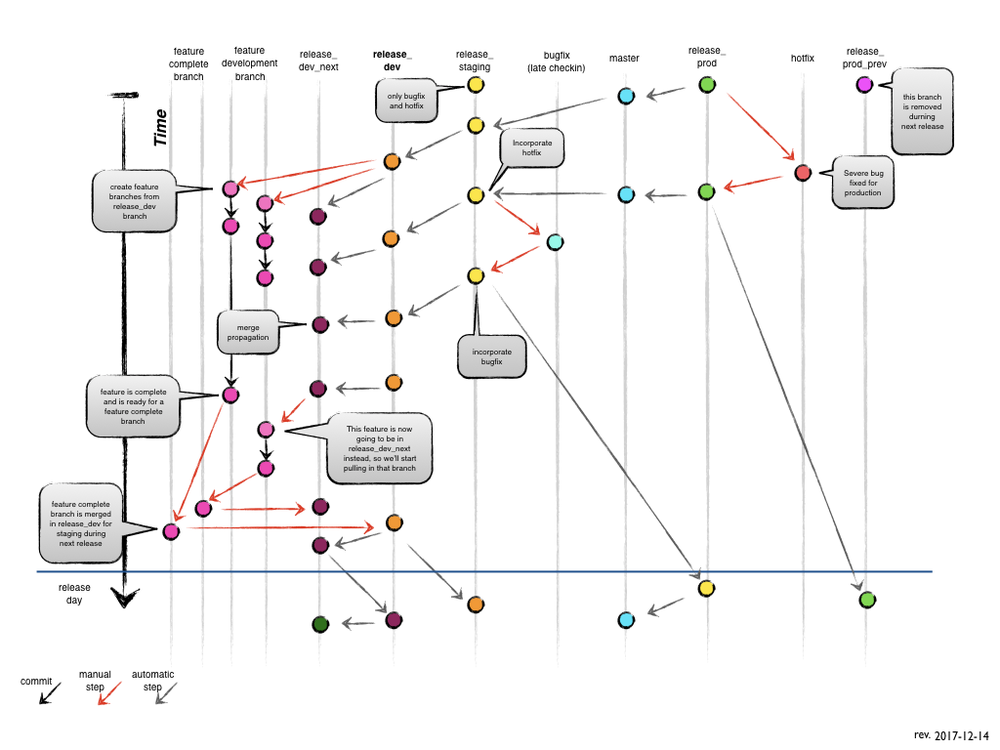

MindTouch GitFlow
=================

To demonstrate the workflow, in this documentation we'll refer to each release as:

* `release_prod_prev` = previous week released code
* `release_prod` = released and currently running
* `release_staging` = code currently testing by QA for release the next week
* `release_dev` = feature merging for QA testing next week and production release in 2 weeks
* `release_dev_next` = feature merging or incremental changes dependent on code from `release_dev` or earlier

> **NOTE:**
> Each release branch above corresponds to a release branch with a date formatted `release_YYYYMMDD` that changes automatically each week. (i.e. `release_20171207`)

## The Main Branch

The central repo holds one main branch with an infinite lifetime:

`master`

origin/master is the main branch where the source code of HEAD always reflects a production-ready state.

Pull requests are not allowed directly to `master`.

## Supporting Branches

these branches always have a limited life time, since they will be removed eventually.

- [Feature branches](FeatureBranches.md)
- [Release branches](ReleaseBranches.md)
- [Hotfix branch](BugBranches.md#hotfix-branch)
- [Bugfix (Late Checkin) branch](BugBranches.md#bugfix-branch)

## Running CodeShip Locally

TODO

## GitFlow Training

[MindTouch's GitFlow training guide](GitFlowTraining.md)

## References

MindTouch GitFlow was adopted from [A successful Git branching model](http://nvie.com/posts/a-successful-git-branching-model/)