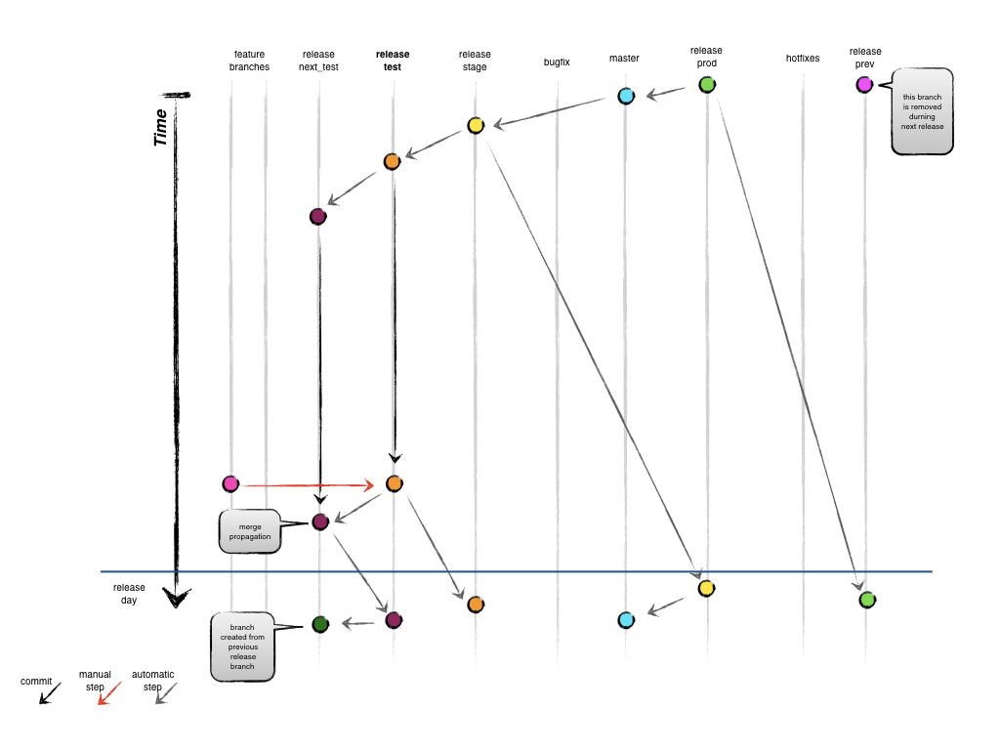

Release Branches
================

*Branches from:*

* the previous release branch

*Merges into:*

* future branches

*Branch naming convention:*

* `release_YYYYMMDD`

#### Note

In these examples, the release branches will be referred as:

* `release_prev`
* `release_prod`
* `release_stage`
* `release_test`
* `release_next_test`

Each branch respectfully matches a dated release branch (`release_YYYYMMDD`) that changes weekly.

Check the engineering channel for current status.

## Creating a release branch

- Bob will automatically create and protect release branches from the previous release branch branch

## Finishing a release branch

- On release day:
    - Release from 2 weeks ago is archived
    - Keep the previous release
    - `release_stage` branch becomes the new `release_prod` branch
    - `release_test` branch becomes the new `release_stage`
    - `release_next_test` is created from `release_test`

## Production Branch

*Branched from:*

`release_prev`

*Merges into:*

`master`

- `release_stage` branch becomes the new `release_prod` branch
- Merge `release_prod` to `master`

