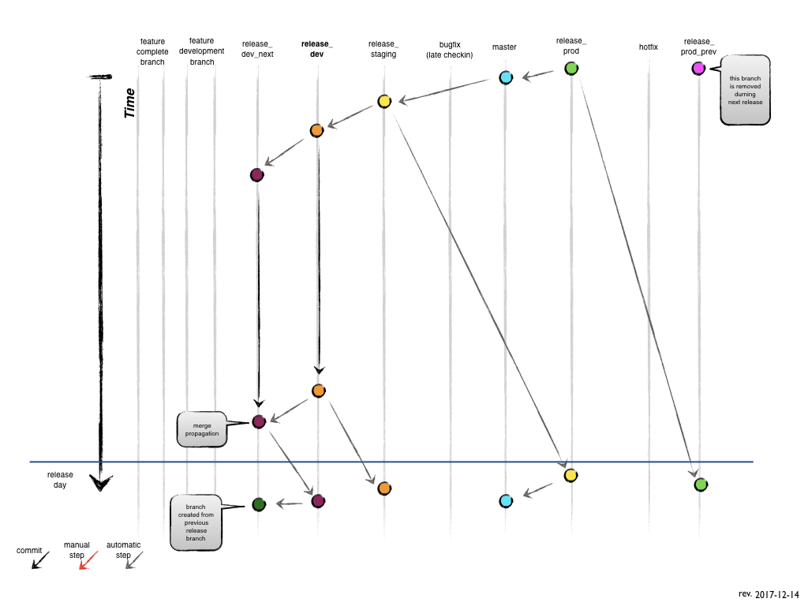

Release Branches
================

*Branches from:*

* the previous release branch

*Merges into:*

* future branches

*Branch naming convention:*

* `release_YYYYMMDD`

To demonstrate the workflow, in this documentation we'll refer to each release as:

* `release_prev` = previous week released code
* `release_prod` = released and currently running
* `release_stage` = code currently testing by QA for release the next week
* `release_test` = feature merging for QA testing next week and production release in 2 weeks
* `release_next_test` = feature merging or incremental changes dependent on code from `release_test` or earlier

> **NOTE:**
> Each release branch above corresponds to a release branch with a date formatted `release_YYYYMMDD` that changes automatically each week. (i.e. `release_20171207`)

## Creating a release branch

- Bob will automatically create and protect release branches from the previous release branch branch

## Finishing a release branch

- On release day:
    - Release from 2 weeks ago is archived
    - Keep the previous release
    - `release_stage` branch becomes the new `release_prod` branch
    - `release_test` branch becomes the new `release_stage`
    - `release_next_test` is created from `release_test`

## Production Branch

*Branched from:*

`release_prev`

*Merges into:*

`master`

- `release_stage` branch becomes the new `release_prod` branch
- Merge `release_prod` to `master`

